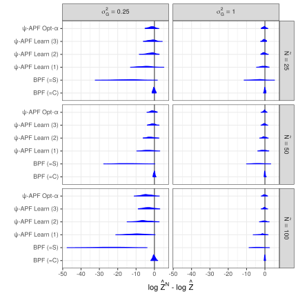

class: center, middle

## Acknowledgement of Country

<p style="text-align: center;">
QUT acknowledges the Turrbal and Yugara as the First Nations owners of the lands where QUT now stands. We pay respect to their Elders, lores, customs and creation spirits. We recognise that these lands have always been places of teaching, research and learning. QUT acknowledges the important role Aboriginal and Torres Strait Islander people play within the QUT community.  
</p>


```{r setup, load_refs, include=FALSE, cache=FALSE}
library(ggplot2)
library(dplyr)
library(tidyr)
library(scales)
library(RColorBrewer)
library(kableExtra)
library(purrr)

library(RefManageR)
BibOptions(check.entries = FALSE,
           bib.style = "authoryear",
           cite.style = "authoryear",
           style = "html",
           hyperlink = FALSE,
           dashed = FALSE)
myBib <- ReadBib("biblio.bib", check = FALSE)

#### Helpers ####
capitalize <- function(string) {
  substr(string, 1, 1) <- toupper(substr(string, 1, 1))
  string
}

attach_name <- function(string, name){
  paste(name, "=", capitalize(string))
}

label_alg <- Vectorize(function(x){
  
  switch(x,
         smc_standard = "Standard",
         smc_da =  "DA+T",
         smc_da_no_trans = "DA",
         smc_sfa_da = "DA+T+SFA",
         smc_sfa_da_no_trans = "DA+SFA",
         smc_sfa = "SFA",
         smc_approx = "Approx"
         )
  
})

cr_label <- trans_format('log10', math_format(10^.x))

parse_labels <- function(values) {
  #values <- paste0("list(", values, ")")
  values <- gsub("`","", values)
  lapply(values, function(expr) c(parse(text = expr)))
}

flabeller <- labeller(likelihood = function(s) capitalize(s),
                      bss_model = function(s) attach_name(s, "Tuning"),
                      alg = function(s) label_alg(s),
                      cost_ratio = label_parsed,
                      iter_group = label_parsed,
                      beta = label_parsed
                      )

scientific_10 <- function(x, remove_1_times = F) {
  exp_text <- ifelse(x > 1,
         gsub("e\\+", " %*% 10^", scales::scientific_format()(x)),
         gsub("e", " %*% 10^", scales::scientific_format()(x))
  )
  
  if(remove_1_times){
    
    exp_text <- gsub("1 %*% ", "", exp_text, fixed = T)
    
  }

  parse(text = exp_text)
  
}

algs_list_sort <- c("smc_standard", 
                    "smc_da", "smc_da_no_trans", 
                    "smc_sfa_da", "smc_sfa_da_no_trans", 
                    "smc_sfa", "smc_approx")

algs_list_names <- c("Standard", 
                     "DA+T", "DA", 
                     "DA+T+SFA", "DA+SFA", 
                     "SFA", "Approx")

facet_label_scientific_rho <- function(x, rv = T){
  
  levels <- unique(x)
  labels <- ifelse(levels > 1,
                   gsub("e\\+", " %*% 10^", scales::scientific_format()(levels)),
                   gsub("e", " %*% 10^", scales::scientific_format()(levels))
  )
  
  labels <- paste("rho ==", gsub("1 %*% ", "", labels, fixed = T))
  
  if(rv){
    ordered(x, levels = rev(levels), labels = rev(labels))
  } else {
    ordered(x, levels = levels, labels = labels)
  }
}

facet_label_gamma <-  function(x){
  
  levels <- c("(0,3]", "(3,6]", "(6,9]", "(9,Inf]")
  new_labs <- c("group('{',list(1,2,3),'}')", 
                "group('{',list(4,5,6),'}')", 
                "group('{',list(7,8,ldots),'}')",
                "group('{',list(7,8,ldots),'}')")
  
  labels <- paste("gamma ==", new_labs)
  
  ordered(x, 
         levels = levels,
         labels = labels
  )
  
}

knitr::opts_chunk$set(cache = T)

source("visual-fk.R")

```
<style>

.list-space li {
padding: 0.25cm;
}

.list-nobullet li {
  list-style-type:none;
}

</style>

---
class: list-space

## 1-step Feynman-Kac

.pull-left[
```{r fk-viz-1, echo = F}

d_plot + theme(text = element_text(size = 20))

```
$M_1(x_0,\cdot) = N(x_0-2,1)$
]
.pull-right[
.content-box-purple[
$$\eta_0 \overset{G_0}{\longrightarrow} \hat\eta_0 \overset{M_1}{\longrightarrow} \eta_1$$
]
- $G_0$ potential function, weights the **measure**
- $M_1$ mutation kernel, mutates the **measure**

]

---
class: list-space

## 1-step particle filter

.pull-left[
```{r fk-viz-2, echo = F}

ds_plot + theme(text = element_text(size = 19))

```
$M_1(x_0,\cdot) = N(x_0-2,1)$
]
.pull-right[
.content-box-purple[
$$\eta_0^N \overset{G_0}{\longrightarrow} \hat\eta_0^N \overset{M_1}{\longrightarrow} \eta_1^N$$
]
- $G_0$ potential function, weights the **particles**
- $M_1$ mutation kernel, mutates the **particles**

]

---

## `r emo::ji("rainbow")` Everything is an integral

If $\mu$ is a probability distribution (or measure) on measurable space $(\mathsf{X},\mathcal{X})$

.pull-left[.content-box-purple[

$$\text{For}~S \in \mathcal{X}, \quad \mu(S) = \int_{S} \mu(\text{d}x)$$

$$\text{For}~\varphi:\mathsf{X}\rightarrow \mathbb{R}, \quad \mu(\varphi) = \int_{\mathsf{X}} \varphi(x) \mu(\text{d}x)$$

]]

.pull-right[.content-box-red[

Or with density (mass) function $p_{\mu}(x)$
$$\mu(\text{d}x) = p_{\mu}(x) \text{d}x, \quad \text{for}~x \in \mathsf{X}$$

]]


<br>
<br>

- Implicit integrals/measures are defined by $\varphi(x) \mu(\text{d}x) \Longleftrightarrow \int_{S} \varphi(x) \mu(\text{d}x)$

- $\varphi$ is assumed to be measurable

---

## `r emo::ji("rainbow")` Everything is an integral

If $K$ is a Markov kernel (or non-negative kernel) on measure space $(\mathsf{X},\mathcal{X})$


.pull-left[.content-box-purple[

$$\text{For}~v \in \mathsf{X}, S \in \mathcal{X}, \quad K(v,S) = \int_{S} K(v,\text{d}x)$$

$$\text{For}~v \in \mathsf{X},\varphi:\mathsf{X}\rightarrow \mathbb{R}, \quad$$
$$K(\varphi)(v) = \int_{\mathsf{X}} \varphi(x) K(v,\text{d}x)$$

]]

.pull-right[.content-box-red[

Or with density (mass) function $p_{K}(v,x)$
$$K(v,\text{d}x)  =p_{K}(v,x) \text{d}x, \quad \text{for}~v,x \in \mathsf{X}$$

]]


- For a fixed $v \in \mathsf{X}$, $K(v,\cdot)$ is a measure
- For a fixed (measurable) function $\varphi$, $K(\varphi)(\cdot)$ is a measurable function
    - allows $\mu(K(\varphi))$ notation


---
class: inverse, center, middle, hide-logo

# Feynman-Kac models 

---

## Discrete-time Feynman-Kac models

A recipe for sequential Monte Carlo algorithms, with ingredients...

--

.content-box-purple[
#### (In)homogeneous Markov chain

$$\boldsymbol{P}_n(\text{d} x_{0:n}) = M_{0}(\text{d} x_{0})\prod_{t=1}^n M_{t}(x_{t-1}, \text{d} x_{t}) \quad \text{on}~(\mathsf{X}^{n+1},\mathcal{X}^{\otimes n+1})$$
]

--

.content-box-red[
#### Potential functions

$$G_0(x_0), G_1(x_1), \ldots, G_n(x_n)$$
]

--

(But does not specify resampling mechanism)

---

## Dynamic model example: Linear Gaussian Markov model

.pull-left[.content-box-purple[
$$M_0(\text{d}x_0) = \mathcal{N}(x_0;a_0,\Sigma_0)\text{d}x_0$$

$$M_p(x_{p-1}, \text{d}x_p) = \mathcal{N}(x_p;Ax_{p-1},\Sigma_M)\text{d}x_p$$

$$G_p(x_p) = \mathcal{N}(y_p;x_p,\Sigma_G)$$
]]

.pull-right[.content-box-purple[

- Inference over latent states

- Unbiased estimate of normalising constant

]]

--

```{r hmm-tikz, echo=FALSE, eval=TRUE, fig.align='center', out.width= 550}

```

--
`r  emo::ji("question")` Static models have a fixed number of unknown quantities

---
class: list-space

## On the path space

A sequence of iterated $\color{magenta}{\text{reweight}}$ and $\color{blue}{\text{mutate}}$ steps...

--

- $\gamma_0(\text{d} x_{0}) = M_0(\text{d}x_0)$

--
- $\boldsymbol{\gamma}_1(\text{d} x_{0:1}) = \gamma_0(\text{d} x_{0})\color{magenta}{G_0(x_0)}\color{blue}{M_1(x_0, \text{d}x_1)}$ 

--
- $\boldsymbol{\gamma}_2(\text{d} x_{0:2}) = \boldsymbol{\gamma}_1(\text{d} x_{0:1})\color{magenta}{G_1(x_1)}\color{blue}{M_2(x_1, \text{d}x_2)}$

---
class: list-space

## On the path space

A sequence of iterated $\color{magenta}{\text{reweight}}$ and $\color{blue}{\text{mutate}}$ steps...


- $\boldsymbol{\gamma}_p(\text{d} x_{0:p}) = \boldsymbol{\gamma}_{p-1}(\text{d} x_{0:p-1})\color{magenta}{G_{p-1}(x_{p-1})}\color{blue}{M_p(x_{p-1}, \text{d}x_p)}$

--
<br><br><br>
$$\boldsymbol{\gamma}_n(\text{d} x_{0:n}) = M_0(\text{d}x_0)\prod_{p=1}^{n}\color{magenta}{G_{p-1}(x_{p-1})}\color{blue}{M_{p}(x_{p-1},\text{d}x_p)}$$
--

Where is $G_n$?

--

$$\hat{\boldsymbol{\gamma}}_n(\text{d} x_{0:n}) = \boldsymbol{\gamma}_n(\text{d} x_{0:n})\color{magenta}{G_n(x_n)}$$

--

<br><br><br>
Predictive path measure $\boldsymbol{\gamma}_n$, updated path measure $\hat{\boldsymbol{\gamma}}_n$

---

## Marginal measures

With $\gamma_0 = M_0$ we can define using a recursive formula 

$$\begin{aligned}\gamma_{p}(S) &= \int_{\mathsf{X}} \gamma_{p-1}(\text{d}x_{p-1})\color{magenta}{G_{p-1}(x_{p-1})}\color{blue}{M_{p}(x_{p-1},S)}\\
\hat{\gamma}_{p}(\text{d}x_p) &= \gamma_{p}(\text{d}x_p)\color{magenta}{G_p(x_p)}\end{aligned}$$

--

Normalised?

--

$$\begin{aligned}\eta_{p}(S) &= \gamma_{p}(S)/\gamma_p(1) \\ 
~\\
\hat{\eta}_{p}(S) &= \hat{\gamma}_{p}(S)/\hat{\gamma}_p(1)\end{aligned}$$

---

## Feynman-Kac summary

.pull-left[
### Marginal space

$x_{p} \in \mathsf{X}$

|             | Measure             | Distribution        |
| ----------- | :-----------------: | :-----------------: |
| Predictive  | $\gamma_p$          | $\eta_p$            |
| Updated     | $\hat{\gamma}_p$    | $\hat{\eta}_p$      |
| Normalised  | `r emo::ji("cross_mark")`| `r emo::ji("check")` |

for $p \in \{0,1,\ldots,n\}$

]

.pull-right[
### Path space

$x_{0:p} \in \mathsf{X}^{p+1}$ 

|             | Measure             | Distribution        |
| ----------- | :-----------------: | :-----------------: |
| Predictive  | $\boldsymbol{\gamma}_p$       | $\boldsymbol{\eta}_p$            |
| Updated     | $\hat{\boldsymbol{\gamma}}_p$ | $\boldsymbol{\hat{\eta}}_p$      |
| Normalised  | `r emo::ji("cross_mark")`          | `r emo::ji("check")`        |

for $p \in \{0,1,\ldots,n\}$
]

---
class: list-space

## Feynman-Kac summary

- The Feynman-Kac model defines the sequence of distributions and how we traverse through them
    - $\gamma_{p-1}$ reweight $\color{magenta}{G_{p-1}}$, mutate $\color{blue}{M_p}$ to $\gamma_p$
--
- Infinitely many models to perform the same statistical inference

--
- Many **bad** models for SMC possible (variance of estimates)

--

<br><br>
.content-box-purple[

How do we improve an existing Feynman-Kac model?

]

---
class: inverse, center, middle, hide-logo

## Twisted Feynman-Kac models

---

## Twist and ~~shout~~ tilt

### Exponential tilting/twisting

For some distribution $\mu$, define

$$\nu(\text{d} x) = \frac{\mu(\text{d} x) \exp(-\lambda x)}{Z}$$
with $Z = \int_{\mathsf{X}}\exp(-\lambda x) \mu(\text{d} x)$.

--

### Change of measure

$$\nu(\text{d} x) = \frac{\mu(\text{d} x) \psi(x)}{Z}$$

with $Z = \mu(\psi) = \int_{\mathsf{X}}\psi(x) \mu(\text{d} x)$.

---
class: list-space

## 1-step Twisted Feynman-Kac

.pull-left[
```{r fk-viz-1-tw, echo = F}

d_t_plot + theme(text = element_text(size = 20))

```
$M_1^\psi(x_0,\cdot) = N(x_0-2,1)$
]
.pull-right[
.content-box-purple[
$$\eta_0^\psi \overset{G_0^\psi}{\longrightarrow} \hat\eta_0^\psi \overset{M_1^\psi}{\longrightarrow} \eta_1^\psi$$
]
- $\eta_1^\psi = \eta_1$, twisting preserves path/terminal distribution
- Using optimal $\psi$, potential/weights are constant

]

---
class: list-space

## 1-step TFK particle filter

.pull-left[
```{r fk-viz-2-tw, echo = F}

ds_t_plot + theme(text = element_text(size = 19))

```
$M_1^\psi(x_0,\cdot) = N(x_0-2,1)$
]
.pull-right[
.content-box-purple[
$$(\eta_0^\psi)^N \overset{G_0^\psi}{\longrightarrow} (\hat\eta_0^\psi)^N \overset{M_1^\psi}{\longrightarrow} (\eta_1^\psi)^N$$
]
- $\eta_1^\psi = \eta_1$, twisting preserves path/terminal distribution
- Using optimal $\psi$, perfect samples from terminal distribution
]

---

## Twisting Feynman-Kac models

Twist the Markov kernels

.content-box-purple[
$$\begin{aligned}M^{\color{red}{\psi}}_0(\text{d}x_0) &= \frac{M_0(\text{d}x_0)\color{red}{\psi_0}(x_0)}{M_0(\color{red}{\psi_0})} \\
&~\\&~\\
M^{\color{red}{\psi}}_p(x_{p-1}, \text{d}x_p) &= \frac{M_p(x_{p-1}, \text{d}x_p)\color{red}{\psi_p}(x_p)}{M_p(\color{red}{\psi_p})(x_{p-1})}\end{aligned}$$
]

---

## Twisting Feynman-Kac models

Also "twist" the potential functions 

.content-box-purple[
$$\begin{aligned} G^{\color{red}{\psi}}_0(x_0) &= \frac{G_0(x_0)}{\color{red}{\psi_0}(x_0)}M_1(\color{red}{\psi_1})(x_0)M_0(\color{red}{\psi_0})\\
&~\\
G^{\color{red}{\psi}}_p(x_p) &= \frac{G_p(x_p)}{\color{red}{\psi_p}(x_p)}M_{p+1}(\color{red}{\psi_{p+1}})(x_p)\\
&~\\
G^{\color{red}{\psi}}_n(x_n) &= \frac{G_n(x_n)}{\color{red}{\psi_n}(x_n)}\end{aligned}$$
]

--

<br><br>
Twisted mutation kernels and potential functions are then used by standard SMC

---

## Twisting Feynman-Kac models

Why??

$$\hat{\boldsymbol{\gamma}}^{\psi}_{n}(\text{d}x_{0:n}) = M_0^\psi(\text{d}x_0)G^{\psi}_0(x_0)\prod_{p=1}^{n}M_p(x_{p-1},\text{d}x_p)G^{\psi}_p(x_p)$$

--

.pull-left[.content-box-purple[
$$\gamma^{\color{red}{\psi}}_{p}(\text{d}x_p) = \gamma_{p}(\text{d}x_p)\color{red}{\psi_p}(x_p)$$
$$\eta^{\color{red}{\psi}}_{p}(\text{d}x_p) = \frac{\eta_{p}(\text{d}x_p)\color{red}{\psi_p}(x_p)}{\eta_p(\color{red}{\psi_p})}$$
<br>
]]

--

.pull-right[.content-box-purple[
$$\hat\eta^{\psi}_{n} = \hat\eta_{n}$$
$$\hat{\boldsymbol{\gamma}}^{\psi}_{n} = \hat{\boldsymbol{\gamma}}_{n}$$
$$\hat{Z}^{\psi} = \hat{Z}$$
]]
---

## Optimal twisting

If we choose

.content-box-red[
$$\psi_p^{\star}(x_p) = \mathbb{E}\left(\prod_{t=p}^{n}G_t(X_t)~\Big\vert~ X_p = x_p\right)$$
]

with $X_{0:n} \sim \boldsymbol{P}_n$, then 

--

.content-box-purple[
$$\hat{Z}_{\psi}^{N} \overset{a.s.}{=}  \hat{Z}$$ 
]

--

and we have a **perfect** sampler for **finite** $N$ (!) for the terminal distribution

---

## Iterated APF and Controlled SMC

- IAPF [(Guarniero et al, 2017)](https://doi.org/10.1080/01621459.2016.1222291) and CSMC [(Heng et al, 2020)](https://doi.org/10.1214/19-AOS1914) use twisted FK models
- Learn twisting functions using a recursion 

--

The optimal twisting functions satisfy

$$\psi_n^{\star}(x_n) = G_n(x_n)$$

$$\psi_p^{\star}(x_p) = G_p(x_p)M_{p+1}(\psi_{p+1}^{\star})(x_p)$$

--

Motivates recursive, iterative learning...

--

.content-box-purple[
**Algorithm:** For class of approximate twisting function $\tilde{\psi}_p \in \mathsf{H}$

1. Run particle filter with current $\psi$, generate $\zeta_p^i$
2. Find new approximation of $\tilde{\psi}_{p}(\zeta_p^i) \approx G_p(\zeta_p^i)M_{p+1}(\tilde{\psi}_{p+1})(\zeta_p^i)$ with backward recursion
3. Repeat
]

---

## Existing applications of recursive learning

Twisted mutation $M_p^{\psi}$ can be sampled from and constant $M_p(\psi_p)$ can be calculated **analytically**.

--

.content-box-purple[
Normal models and exponential-quadratic $\psi$
$$M_p = \mathcal{N}(f(x_{p-1}),\Sigma)$$
$$\psi_p(x_p) = \exp\left(- x_{p}^{\top} A x_{p} + bx_{p} + c \right)$$
where $A$ is PSD.

Then $M_p^{\psi} = \mathcal{N}(f_{\psi}(x_{p-1}),\Sigma_{\psi})$ can be calculated **analytically**
]

`r emo::ji("exclamation_mark")` Almost all use-cases are normal

---
class: inverse, center, middle, hide-logo

## Beyond exact twisting `r emo::ji("star")`

---

## Extending beyond the analytical case 

What if there is no class of appropriate $\psi$ functions that are tractable?

- $M_p$ intractable 
- $M_p^{\psi}$ unable to be sampled from

--
<br><br><br>
.content-box-blue[
**Idea**: Rejection sampler + Unbiased estimate of twisted potentials
]

---
class: list-space

## Extending beyond the analytical case 

### Rejection sampler

- Restrict $\psi: \mathsf{X}\rightarrow [0,1]$
- Propose $x \sim M_p$ until $\psi_p(x) > U$, where $U \sim \text{Uniform}(0,1)$

--

Accepted realisations have the correct twisted distribution: $x \sim M_p^{\psi}$

---
## Extending beyond the analytical case 

### Unbiased estimate of twisted potentials

$$\tilde{G}_p^{\psi}(x_p) = \frac{G_p(x_p)}{\psi_p(x_p)}\color{green}{\tilde{M}_{p+1}(\psi_{p+1})(x_p)}$$

--

.content-box-purple[

$$\tilde{M}_{p+1}(\psi_{p+1})(x_p) = K^{-1}\sum_{i=1}^{K}\psi_{p+1}(u^{i}_{p+1}) \qquad \qquad \qquad u^{i}_{p+1} \sim M_{p+1}(x_p, \cdot)$$

]

---
class:list-space

## Twisted models by rejection-sampling and unbiased potentials

Applicable to **any** Feynman-Kac model with bounded $\psi$ and where mutations can be sampled from, using 

--

- Rejection for twisted mutation
    - Exact twist
    - Potentially costly sampler

--

- Monte Carlo for twisted potential
    - Simple 
    - Potentially noisy estimate

--

<br><br><br>
How to address concerns?

---
class: list-space

## Controlling cost of rejection sampler

- Rejection sampler for $M^{\omega}_p$ has acceptance rate: $$M_p(\omega_p)$$

- Conditional on $x_{p-1}$ but embedded within SMC

- Average acceptance rate $$\hat{\eta}_{p-1}^{\omega}(M_p(\omega_p)) \quad \text{or} \quad M_0(\omega_{0})$$

---

## Controlling cost of rejection sampler

**Prop.** If we have a $\psi$-twisted Feynman-Kac model, then the average acceptance rates of a $\omega$-twisted model can be written as

$$\begin{aligned}
\alpha_{p}^{\omega} &\equiv \hat{\eta}_{p-1}^{\omega}(M_p(\omega_p)) =  \frac{\hat\eta_{p-1}^{\psi}( M_{p}(\omega_{p})^2 \cdot M_{p}(\psi_{p})^{-1} )}{\hat\eta_{p-1}^{\psi}( M_{p}(\omega_{p}) \cdot M_{p}(\psi_{p})^{-1})} ~\text{for}~p \in [n], \\
\alpha_{0}^{\omega} &\equiv M_0(\omega_{0}).
\end{aligned}$$

--

<br><br>
`r emo::ji("exclamation_mark")` A quantity for average RS acceptance rates within a particle filter
<br><br>
--

`r emo::ji("double_exclamation_mark")` A way to estimate without ever running the same particle filter

--

.content-box-purple[
**Target $\alpha$**: Use in the iterative learning algorithm and temper the new twisting functions
]

---
class: list-space

## Sketch of proof

New twisting functions decomposed as $\omega_p = \psi_p \cdot \phi_p$

- Two elegant properties
    - $(\hat\gamma_{p-1}^{\psi})^\phi = \hat\gamma_{p-1}^{\psi\cdot\phi}$
    - $(\hat\gamma_{p-1})^\phi(\text{d} x_{p-1}) = \hat{\gamma}_{p-1}(\text{d} x_{p-1}) M_{p}(\phi_{p})(x_{p-1})$
- Yields
    - $\hat{\gamma}_{p-1}^{\omega}(\text{d} x_{p-1}) = \hat{\gamma}_{p-1}^{\psi}(\text{d} x_{p-1}) M_{p}^{\psi}(\phi_{p})(x_{p-1})$
    - Normalise then simplify
  
Can't evaluate $M_{p}^{\psi}(\phi_{p})(x_{p-1})$ analytically, but substitute $M_{p}^{\psi}(\phi_{p}) = \frac{ M_{p}(\omega_{p})}{M_{p}(\psi_{p})}$

---

## Analysing PF variance with estimate of twisted potentials

**Prop**: If the relative variance of estimated potential is uniformly bounded, that is
$$
\mathrm{Var}\left(\frac{\tilde{G}_p(\tilde{x}_p)}{G_p(x_p)}~\Big\vert~ x_p\right) < C
$$
then the asymptotic variance satisfies

$$\tilde{\sigma}_n^{2}(\varphi \otimes 1) < (C+1) \sigma_n^{2}(\varphi)$$
---
class: list-space

## Flavour of proof

- Define a new equivalent Feynman-Kac model on augmented state-space
    - Extended state-space accounts for randomness of twisted potential estimate
- Asymptotic variance

$$\begin{aligned}
\tilde{\sigma}^2_n(\varphi \otimes 1) &= N^{-1}\sum_{p=0}^{n} \tilde{v}_{p,n}(\varphi \otimes 1)
\end{aligned}$$

Bound each $v_{p,n}(\varphi)$ using  $\mathrm{Var}\left(\frac{\tilde{G}_p(\tilde{x}_p)}{G_p(x_p)}~\Big\vert~ x_p\right) < C$

--

<br><br>
`r emo::ji("exclamation_mark")` Effect of using estimate is isolated, does not compound (asymptotically)


---

## Example: Linear Gaussian Markov model

Model

- $d=3$, $n = 200$
- $a_0 = [1~1~1]$, $\Sigma_0 = I_{d}$
- $\Sigma_M = I_{d}$
- $\Sigma_G = \sigma^2_{G}I_{d}$ with $\sigma^2_{G} \in \{0.25,1.0\}$
- $A$ are such that $A_{i,j} = a^{\vert i-j\vert + 1}$ with $a = 0.42$

Algorithm

- 3 iterations of iterative learning
    - $\alpha$ target $= 0.04, 0.02, 0.01$
- $N = 200$ particles for twisted models
- Dynamic multinomial resampling with $N/2$ threshold
- $\tilde{N} \in \{25,50,100\}$
 
Tested over 100 repetitions 

---

## Results

```{r twist-rej, echo=FALSE, eval=TRUE, fig.align='center', out.width= 450}

```


---
class: list-space

## Future work and opportunities 


**Rejection-based twisting**

- Other types of exact samplers
    - Use hybrid between rejection and analytical integration for better performance 

- Apply rejection-based twisting ideas to new statistical models

- Relate average acceptance rate to asymptotic variance to choose target acceptance rate
    - Identify models method will be appropriate for


---
class: inverse, center, middle, hide-logo

## Thank you for listening!
